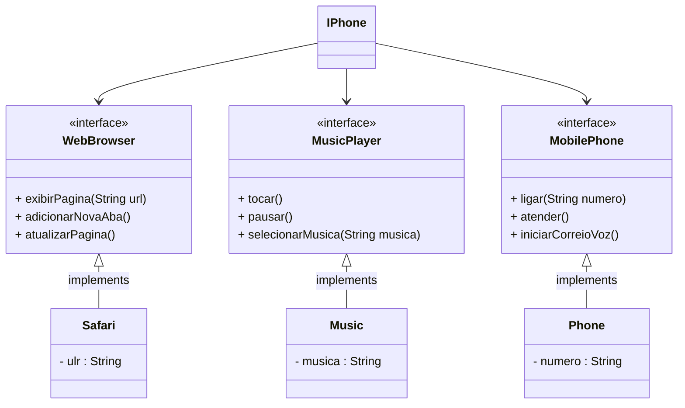

# dio-desafio-poo

```mermaid
classDiagram
    IPhone --> WebBrowser
    IPhone --> MusicPlayer
    IPhone --> MobilePhone
    WebBrowser <|-- Safari : implements
    MusicPlayer <|-- Music : implements
    MobilePhone <|-- Phone : implements
    
    class IPhone{

    }


    class WebBrowser{
        <<interface>>
        + exibirPagina(String url)
        + adicionarNovaAba()
        + atualizarPagina()
    }
    class Safari {
        - ulr : String

    }

    class MusicPlayer{
        <<interface>>
        + tocar()
        + pausar()
        + selecionarMusica(String musica)
    }

    class Music {
        - musica : String
    }

    class MobilePhone{
        <<interface>>
        + ligar(String numero)
        + atender()
        + iniciarCorreioVoz()
    }

    class Phone{
        - numero : String
    }
```
